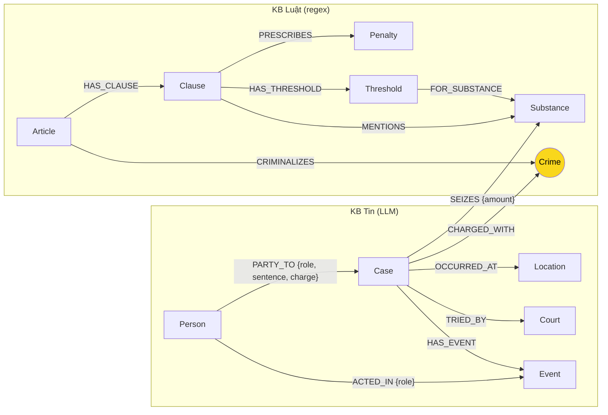

# Thiết kế Ontology — Day 19

**Họ tên:** Đỗ Hoàng Nam Khánh  **MSSV:** 02423

**Lựa chọn** (đánh dấu một):
- [ ] Dùng ontology gợi ý (có thể chỉnh nhỏ)
- [x] Tự thiết kế (xét bonus +15, xem `SUBMISSION.md`)

> Tên ontology: **DrugKG-2**. Khác ontology gợi ý có chủ đích: tách **khung hình phạt** và **ngưỡng khối lượng** thành node, tách **giai đoạn tố tụng** thành node `Event`, gộp **tên chất đồng nghĩa** qua `aliases`, và dùng **khóa định danh ổn định** cho `Case`.

## 1. Sơ đồ

Node cầu nối là `Crime` (ô vàng). Đường xuyên 2 KB: `Case -CHARGED_WITH-> Crime <-CRIMINALIZES- Article` (3 cạnh).

## 2. Entity types (node labels)

| Label | Ý nghĩa | Khóa định danh (`MERGE` theo) | Properties | Lấy từ KB nào | Trích bằng (regex / LLM / khác) |
| --- | --- | --- | --- | --- | --- |
| `Article` | Một Điều luật | `id` = "Điều 251 BLHS" | `id, number, title, law, doc_id` | Luật | regex (frontmatter + tiêu đề) |
| `Clause` | Một khoản của Điều | `id` = "Điều 251 BLHS khoản 1" | `id, number, text, doc_id` | Luật | regex `^(\d+)\.` |
| `Penalty` | Khung hình phạt của một khoản | `id` = `<clause_id>#penalty` | `id, kind, min_years, max_years, life, death, text, doc_id` | Luật | regex trên câu "thì bị ..." |
| `Threshold` | Ngưỡng khối lượng/thể tích của một chất trong một khoản | `id` = `<clause_id>#th<n>` | `id, min_g, max_g, unit, raw, doc_id` | Luật | regex "từ X đến dưới Y", "X trở lên" |
| `Crime` | Tội danh — **node cầu nối** | `name` (đã chuẩn hóa) | `name` | cả hai | regex (tiêu đề Điều) + `link_entity` |
| `Substance` | Chất ma túy / tiền chất | `name` (chuẩn hóa) | `name, aliases` | cả hai | danh mục chuẩn (luật) + LLM (tin) |
| `Case` | Một vụ việc trong bài báo | `id` = `doc_id + "#" + <index>` | `id, name, summary, date, stage, doc_id` | Tin | LLM → JSON |
| `Person` | Người liên quan | `name` (chuẩn hóa) | `name, aliases` | Tin | LLM |
| `Location` | Địa điểm | `name` (chuẩn hóa) | `name` | Tin | LLM |
| `Court` | Tòa án xét xử | `name` (chuẩn hóa) | `name` | Tin | LLM |
| `Event` | Sự kiện tố tụng (bắt, khởi tố, xét xử, tuyên án…) | `id` = `<case_id>#ev<n>` | `id, type, date, doc_id` | Tin | LLM |

## 3. Relationships

| Type | Từ → Đến | Properties trên cạnh | Ý nghĩa |
| --- | --- | --- | --- |
| `HAS_CLAUSE` | `Article` → `Clause` | – | Điều có các khoản |
| `CRIMINALIZES` | `Article` → `Crime` | – | Điều định nghĩa tội (cầu phía luật) |
| `PRESCRIBES` | `Clause` → `Penalty` | – | Khoản quy định khung hình phạt |
| `HAS_THRESHOLD` | `Clause` → `Threshold` | – | Khoản có ngưỡng khối lượng |
| `FOR_SUBSTANCE` | `Threshold` → `Substance` | – | Ngưỡng áp cho chất nào |
| `MENTIONS` | `Clause` → `Substance` | – | Khoản có nhắc tới chất (giữ để lấy ngữ cảnh) |
| `CHARGED_WITH` | `Case` → `Crime` | – | Vụ bị truy tố tội (cầu phía tin) |
| `SEIZES` | `Case` → `Substance` | `amount, unit` | Vụ thu giữ chất và khối lượng |
| `OCCURRED_AT` | `Case` → `Location` | – | Địa điểm xảy ra |
| `TRIED_BY` | `Case` → `Court` | – | Tòa xét xử |
| `PARTY_TO` | `Person` → `Case` | `role, sentence, charge` | Vai trò, mức án, tội danh của người |
| `HAS_EVENT` | `Case` → `Event` | – | Vụ có sự kiện tố tụng |
| `ACTED_IN` | `Person` → `Event` | `role` | Người tham gia sự kiện |

## 4. Node cầu nối giữa 2 KB

- **Node nào:** `Crime` (tội danh).
- **Vì sao chọn node này:** Đây là khái niệm duy nhất xuất hiện ở **cả hai** KB với cùng "ý nghĩa pháp lý": luật định nghĩa tội (`Article -CRIMINALIZES-> Crime`), tin cho biết vụ bị truy tố tội gì (`Case -CHARGED_WITH-> Crime`). Không chọn `Substance` vì một chất được nhắc ở nhiều Điều và nhiều vụ nên cầu sẽ nối bừa. Đường xuyên 2 KB là 3 cạnh, thỏa giới hạn ≤ 4 của `--check`.
- **Cách đảm bảo hai phía khớp tên:**
  1. Trích tiêu đề Điều → danh sách tội danh chuẩn (`normalize_crime`: bỏ "Tội", lower, gộp khoảng trắng).
  2. Đưa **nguyên danh sách tên chuẩn** đó vào prompt trích xuất tin ("BẮT BUỘC chọn đúng nguyên văn").
  3. Vẫn cho qua `link_entity` (KG-1): khớp chính xác sau chuẩn hóa, else `difflib.get_close_matches(cutoff=0.8)`; không đủ giống → bỏ (không đoán bừa). `link_entity` xử lý được các biến thể "tuý/túy", hoa thường, tiền tố "Tội".
- **Khi nào cầu gãy, và xử lý thế nào:**
  - Báo viết hành vi dân sự/chưa đến mức hình sự (ví dụ "sử dụng trái phép chất ma túy" — không có Điều riêng trong corpus) → `link_entity` trả `None`, `Case` không có `CHARGED_WITH`. Chấp nhận: giữ vụ với `stage` và `Event` thay vì gắn sai tội.
  - Báo dùng từ khác luật ("vận chuyển thuê", "mua bán số lượng lớn") → fuzzy match bắt được nếu ≥ 0,8; nếu không thì để trống và ghi nhận ở báo cáo (lỗi E1).
  - Nhiều vụ gộp trong một bài (Viện Pháp y tâm thần) → tách theo từng mục; tên `Case` do LLM đặt có thể gộp nhầm, nhưng khóa `doc_id#index` khiến mỗi vụ trong một bài là **một node ổn định** giữa các lần chạy.

## 5. Competency questions

| Câu | Đường đi (Cypher pattern) | Trả lời được? |
| --- | --- | --- |
| Q1 | `(Article {id:'Điều 2 Luật PCMT'})-[:HAS_CLAUSE]->(Clause {number:4})` → lấy `text` (định nghĩa "tiền chất") | Có |
| Q2 | `(Person {name:'Trần Thanh Tuấn'})-[:PARTY_TO {sentence}]->(Case)-[:CHARGED_WITH]->(Crime)` | Có |
| Q3 | `(Person {name:'Lê Minh Thành'})-[:PARTY_TO]->(Case)-[:CHARGED_WITH]->(Crime)<-[:CRIMINALIZES]-(Article {id:'Điều 251 BLHS'})-[:HAS_CLAUSE]->(Clause)-[:PRESCRIBES]->(Penalty)` | Có |
| Q4 | `(Person)-[:PARTY_TO]->(Case)-[:CHARGED_WITH]->(Crime)<-[:CRIMINALIZES]-(Article {id:'Điều 255 BLHS'})-[:HAS_CLAUSE]->(Clause)-[:PRESCRIBES]->(Penalty)` — lấy `Penalty` có `max_years`/`life` lớn nhất | Có |
| Q5 | `(Person {name:'Cái Quang Huy'})-[:PARTY_TO]->(Case)-[:SEIZES {amount:'9,6kg'}]->(Substance {name:'MDMA'})`; so `9.600g` với `(Clause)-[:HAS_THRESHOLD]->(Threshold)-[:FOR_SUBSTANCE]->(MDMA)` để chọn khoản 4 Điều 250 | Có (nhờ mô hình hóa ngưỡng) |
| Q6 | `(Substance {name:'MDMA'})<-[:SEIZES]-(Case)` (kèm `-[:PARTY_TO]-(Person)`) → liệt kê mọi vụ | Có |

Q4/Q5 là điểm mà ontology gợi ý trả lời **thiếu/sai**: gợi ý chỉ giữ khoản 1 + mọi khoản `MENTIONS` chất, nên với Q5 đưa cả 4 khoản (2,3,4) vào prompt — LLM dễ chọn sai khung; còn Q4 không có gợi ý "khung cao nhất" nên chỉ có khoản 1 (max 07 năm), thiếu "tù chung thân".

## 6. Quyết định thiết kế và đánh đổi

1. **Khung hình phạt là node `Penalty`, không phải property chuỗi trên `Clause`.**
   - Phương án khác: giữ `penalty` là property chuỗi (như gợi ý).
   - Vì sao chọn: tách được `min_years/max_years/life/death` để **so sánh/tìm khung cao nhất** bằng Cypher, trả lời đúng câu hỏi "tối đa bao nhiêu" (Q4) thay vì để LLM đọc chuỗi dài.
   - Đánh đổi: graph to hơn và regex phải xử lý nhiều dạng câu ("tù từ X đến Y", "X năm, tù chung thân hoặc tử hình").

2. **Mô hình hóa ngưỡng khối lượng bằng node `Threshold`.**
   - Phương án khác: để khối lượng chỉ là text trong `Clause`, hoặc dùng chung `MENTIONS`.
   - Vì sao chọn: ngưỡng là **thuộc tính định lượng** quyết định chọn đúng khoản. Có `Threshold(min_g, max_g)` mới map được "9,6kg MDMA" → khoản 4 Điều 250 (Q5).
   - Đánh đổi: phải parse số liệu luật bằng regex; các điểm gộp nhiều chất ("Heroine, Cocaine, … hoặc XLR-11 có khối lượng từ…") phải gán cùng ngưỡng cho nhiều chất.

3. **Tách giai đoạn tố tụng thành node `Event` + property `stage` trên `Case`.**
   - Phương án khác: chỉ có `Case` và `Person` (như gợi ý).
   - Vì sao chọn: tin phân biệt bắt / khởi tố / xét xử sơ thẩm / phúc thẩm / tuyên án; câu hỏi "bị bắt về hành vi gì" (Q4) cần `Event.type='bắt'`. Gợi ý không phân biệt được các giai đoạn.
   - Đánh đổi: prompt trích xuất dài hơn và phụ thuộc LLM, nên thêm bước kiểm tra hợp lệ trong code.

4. **`Substance` có `aliases`, gộp tên đồng nghĩa.**
   - Phương án khác: `MERGE` theo đúng chuỗi LLM trả về (gợi ý) → "thuốc lắc"/"kẹo"/"MDMA" thành 3 node (lỗi E3).
   - Vì sao chọn: giữ danh mục chuẩn + `aliases`, mọi cách gọi gộp về một node, để câu aggregation Q6 đếm đúng.
   - Đánh đổi: phải bảo trì danh sách `aliases`.

5. **Khóa định danh `Case` = `doc_id#index` thay vì tên do LLM đặt.**
   - Phương án khác: `MERGE` theo `name` (gợi ý) → mỗi lần chạy LLM đặt tên khác, node bị tạo lại/trùng.
   - Vì sao chọn: khóa ổn định, tái lập được giữa các lần `--build`; `doc_id` có sẵn phục vụ nối chunk vector ↔ node.
   - Đánh đổi: hai bài báo về cùng một vụ sẽ thành 2 `Case` (không gộp xuyên bài); chấp nhận vì gộp xuyên bài bằng tên LLM còn rủi ro hơn.

## 7. So với ontology gợi ý (bắt buộc nếu xét bonus)

| Điểm khác | Gợi ý làm gì | Bạn làm gì | Vấn đề nó giải quyết | Bằng chứng (Cypher, hoặc số liệu benchmark) |
| --- | --- | --- | --- | --- |
| Khung hình phạt | `Clause.penalty` là chuỗi (không so sánh được) | Node `Penalty` (`min_years, max_years, life, death`) | Trả lời câu "tối đa" (Q4) bằng truy vấn, không để LLM tự đọc chuỗi | `MATCH (a:Article {id:'Điều 255 BLHS'})-[:HAS_CLAUSE]->(cl)-[:PRESCRIBES]->(p) RETURN cl.number, p.max_years, p.life ORDER BY cl.number` → khoản 4: `max_years=null, life=true`. Benchmark Q4: graph `recall=1.00/judge=2` ("tối đa ... tù chung thân theo khoản 4 Điều 255"), flat `0.00/0`. |
| Ngưỡng khối lượng | Không mô hình hóa (chỉ có text) | Node `Threshold(min_g,max_g,unit)` + `FOR_SUBSTANCE` | Chọn đúng khoản theo khối lượng (Q5) | `MATCH (a:Article {id:'Điều 250 BLHS'})-[:HAS_CLAUSE]->(cl)-[:HAS_THRESHOLD]->(t)-[:FOR_SUBSTANCE]->(:Substance {name:'MDMA'}) RETURN cl.number, t.min_g, t.max_g ORDER BY cl.number` → khoản 1 (0,1–5g), 2 (5–30g), 3 (30–100g), **4 (≥100g)**. 9,6kg = 9600g ⇒ chọn khoản 4. Q5: graph `1.00/2`, flat `0.60/1` (flat trả "khoản b)"). |
| Giai đoạn tố tụng | Không phân biệt bắt/khởi tố/xét xử | Node `Event` + `Case.stage` | Trả lời "bị bắt về hành vi gì" (Q4) | `MATCH (p:Person {name:'Dương Minh Tuấn'})-[:PARTY_TO]->(k:Case)-[:HAS_EVENT]->(e:Event) RETURN DISTINCT k.name, e.type` → 4 vụ với `e.type='bắt giữ'`. |
| Đồng nghĩa chất | `MERGE` theo tên LLM → dễ tách "kẹo"/"thuốc lắc"/"MDMA" | `Substance.aliases` + danh mục chuẩn | Giảm trùng thực thể (E3), đếm đúng ở Q6 | `MATCH (s:Substance) WHERE s.name CONTAINS 'MDMA' RETURN s.name, s.aliases` → 1 node duy nhất với aliases `[mdma, thuốc lắc, ma túy kẹo, kẹo, ecstasy, nước vui]`; tổng chỉ **11** Substance. |
| Khóa `Case` | `MERGE` theo tên do LLM đặt | `doc_id#index` | `MERGE` ổn định, không trùng giữa các lần chạy | `MATCH (k:Case) RETURN count(k)` = **14** (ổn định qua các lần `--build`). |

> Đường cầu nối hoạt động: `MATCH p=(:Case)-[:CHARGED_WITH]->(:Crime)<-[:CRIMINALIZES]-(:Article) RETURN count(p)` = **18** đường.
> Benchmark tổng hợp (OpenRouter `openai/gpt-4o-mini`, top_k=3): DrugKG-2 GraphRAG **recall 0.89 / judge 1.83**, Flat RAG **recall 0.43 / judge 1.00**; riêng Q3/Q4/Q5 (cross-KB) GraphRAG đạt **recall 1.00**.
> Đối chiếu ontology gợi ý (`ket_qua_benchmark_kg.hint.txt`, cùng model/top_k): GraphRAG **recall 0.66 / judge 1.33** — Q4 `recall=0.00, judge=0` ("Không đủ thông tin") và Q5 chọn nhầm **Điều 251 khoản 3**; DrugKG-2 trả đúng **Điều 255 khoản 4** (Q4) và **Điều 250 khoản 4** (Q5).

## 8. Hạn chế còn lại

- `Person` khóa theo tên đã chuẩn hóa nhưng chưa xử lý **đại từ/nhân xác** ("Huy", "Hoàng Nato", "Dương Minh Tuấn" là cùng người) nếu báo không cho `aliases` rõ ràng.
- `Threshold` chỉ lấy ngưỡng **khối lượng thể rắn**; các trường hợp "tổng khối lượng nhiều chất tương đương" (điểm p/h) không mô hình hóa được, nên Q5 dạng nhiều chất có thể lệch.
- Không gộp `Case` xuyên nhiều bài báo; các số liệu tổng hợp (Q6) dựa vào việc mỗi bài tách vụ đúng.
- `Event` chất lượng phụ thuộc LLM; có thể thiếu loại sự kiện nếu bài báo diễn đạt không tường minh.
